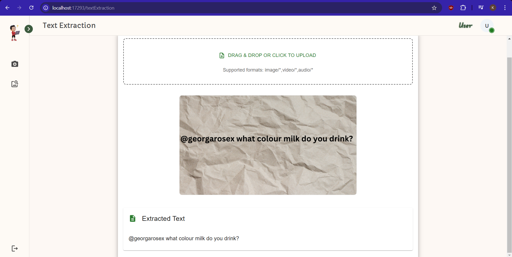
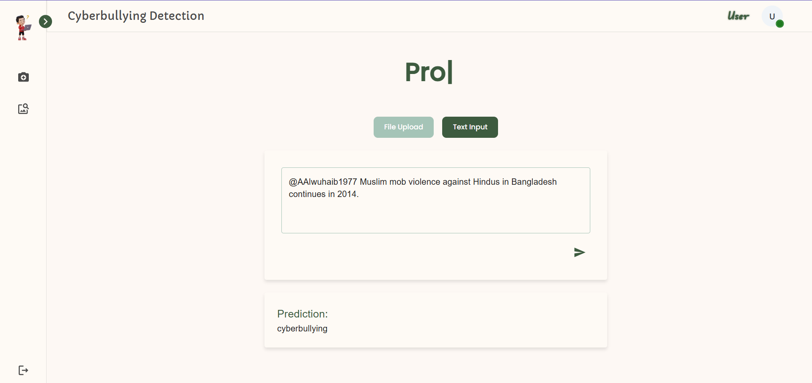
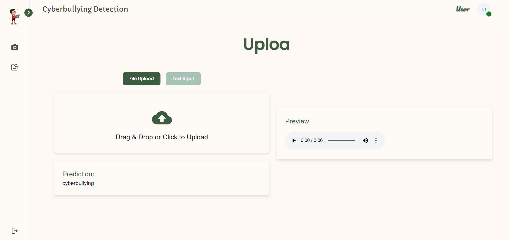

# Cyberbullying Detection using BERT

To view the demo, [click here](https://github.com/kadirikumar-uptycs/Cyberbullying_Classification/blob/main/result.mp4) to download and play the video locally.

## Current Features

1. Text Extraction from Image ✅, Audio ✅ and Video ⌛(Not fully done).

   
2. Identify cyberbullying from the uploaded Text or File.

   

   

### Allowed File Formats

1. Image - `jpg`, `jpeg`, `png`, `bmp`, `tiff`
2. Audio - `wav`, `mp3`, `ogg`, `flac` (but only .wav is working as of now)
3. video - `mp4`, `avi`, `mov`, `mkv` (Not completed fully, you might get errors)

## Backend Setup

### Requirements

- Python 3.8+
- pip (Python package installer)

### Installation

1. Navigate to the `backend` directory:

   ```sh
   cd backend
   ```
2. Install the required packages:

   ```sh
   pip install -r requirements.txt
   ```
3. Download and install Tesseract installer from: [Link](https://github.com/UB-Mannheim/tesseract/wiki) and add the installation directory to your system PATH
4. Download BERT model weights from Google drive [weights.pth

   ](https://drive.google.com/file/d/1JJbCi_bk_65H1uu3ge2o68IGFAXjsjdM/view?usp=sharing)
5. Move the downloaded weights to `backend\app\weights` folder.

### Running the Backend

1. Ensure all the dependencies are installed.
2. Run the backend server:

   ```sh
   python run.py
   ```

## Frontend Setup

### Requirements

- Node.js
- npm (Node package manager)

### Installation

1. Navigate to the frontend directory:

   ```sh
   cd frontend
   ```
2. Install the required packages:

   ```sh
   npm install
   ```

### Running the Frontend

1. Start the development server:

   ```sh
   npm start
   ```
2. Open [http://localhost:17293](http://localhost:17293) to view it in your browser.

## License

Please read the full license text in the directory to understand the permissions, restrictions, and requirements for usage, redistribution, and modification.
